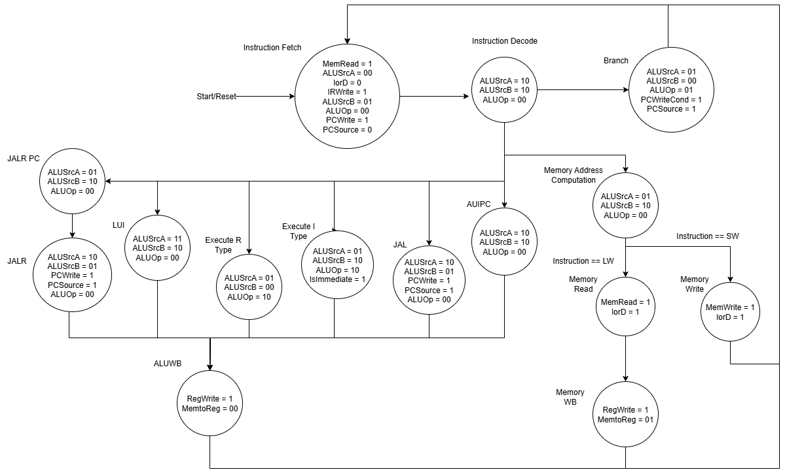
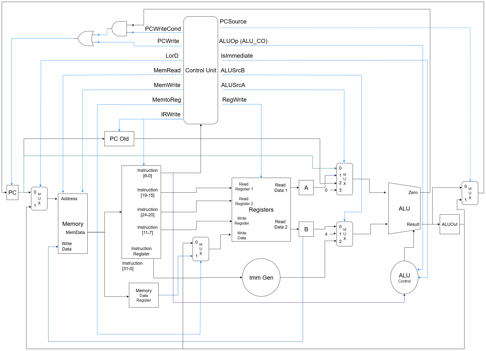

# Datapath ou Caminho de Dados

Neste laboratório você irá finalmente terminar de montar o seu processador. O Caminho de Dados nada mais é que o conjunto de conexões entre os módulos do processador, juntamente com algumas estruturas para auxiliar nessa ligação como multiplexadores e registradores. Uma vez que o caminho de dados estiver pronto, o processador já será capaz de receber instruções e executá-las.

## Partes do Caminho de Dados

A figura abaixo mostra um diagrama com o caminho de dados completo, incluindo tanto os módulos do processador quanto as estruturas auxiliares. Os principais trechos do caminho de dados serão descritos a seguir, indo da esquerda para a direita:

- Lógica do próximo PC: o registrador de PC fica na extrema esquerda do caminho de dados, e tem duas entradas, sendo elas o valor do PC e o sinal de habilitar a escrita. A escrita é habilitada pelo resultado de uma função lógica que encolve os sinais de controle PCWrite, PCWriteCond e também o sinal de zero da ALU.

- Multiplexador da memória: este multiplexador escolhe o endereço que a memória irá receber. Ora ele vem do PC, para buscar instruções, ora vem da saída da ALU, para buscar dados.

- Instruction Register: registrador que guarda a instrução lida da memória para uso posterior

- Memory Data Register: registrador que guarda o valor lido da memória para uso posterior

- Multiplexador de escrita no banco de registradores: seleciona qual valor será escrito no banco. Pode ser da memória ou da ALU.

- Registradores A e B: guardam o valor lido do banco de registradores para uso posterior.

- Multiplexadores da ALU: essa é a parte mais complexa do caminho de dados. Para cada instrução, um par de operandos deve ser fornecido para a ALU. Eles podem ser o valor lido do banco de registradores, o PC ou mesmo constantes.

- Multiplexador da saída da ALU: quando o PC é incrementado de 4, o resultado da ALU vai diretamente para o PC. Quando o novo PC é resultado de um branch ou jump, ele vem do registrador ALUOut

Uma dica para compreender cada parte do caminho de dados é observar o fluxo de cada tipo de instrução: acompanhe a máquina de estados da unidade de controle enquanto vê as partes do caminho de dados que são acionadas.





## Atividade

Coloque todos os módulos desenvolvidos até agora no diretório deste laboratório e construa o caminho de dados instanciando os módulos e criando as estruturas auxiliares. A estrutura do código é a seguinte:

```text
core_top.v
|_ memory.v
|_ core.v
    |_ demais módulos...
```

A memória se conecta no core por meio do barramento de memória e os únicos sinais que vão para o top são o relógio e o reset.

```verilog
module Core #(
    parameter BOOT_ADDRESS = 32'h00000000
) (
    // Sinais de controle
    input wire clk,
    input wire rst_n,

    // Barramento de memória
    output wire rd_en_o,
    output wire wr_en_i,
    input  wire [31:0] data_i,
    output wire [31:0] addr_o,
    output wire [31:0] data_o
);

```

> DICA: o processador precisa ter um PC inicial após o reset. O valor dele deve ser dado pelo parâmetro `BOOT_ADDRESS`. Use zero.

```verilog
module Memory #(
    parameter MEMORY_FILE = "",
    parameter MEMORY_SIZE = 4096
)(
    input  wire        clk,

    input  wire        rd_en_i,    // Indica uma solicitação de leitura
    input  wire        wr_en_i,    // Indica uma solicitação de escrita

    input  wire [31:0] addr_i,     // Endereço
    input  wire [31:0] data_i,     // Dados de entrada (para escrita)
    output wire [31:0] data_o,     // Dados de saída (para leitura)

    output wire        ack_o       // Confirmação da transação
);
```

> DICA: o sinal de resposta da memória, `ack_o` não será usado, pois a memória sempre responde no mesmo ciclo.

```verilog
module core_top #(
    parameter MEMORY_FILE = ""
)(
    input  wire        clk,
    input  wire        rst_n
);
```

## Execução da Atividade

Utilize os templates fornecidos e execute os testes com o script `./run-all.sh`. O resultado será exibido como `OK` em caso de sucesso ou `ERRO` se houver alguma falha.

Se necessário, crie casos de teste adicionais para validar sua implementação.

### Observação importante para a correção

Para que o testbench consiga acessar a memória do seu processador e atribuir uma nota, deve haver um padrão de nomes para a memória.

Primeiro: ao instaciar a memória no seu módulo `core_top.v`, use o nome `mem`.

```verilog
Memory #(
    .MEMORY_FILE(),
    .MEMORY_SIZE()
) mem (
    .clk(),
    .rd_en_i(),
    ...
);
```

Segundo: dentro do módulo `memory.v`, o array que armazena os dados deve ter o nome `memory`.

```verilog
module Memory #(
    parameter MEMORY_FILE = "",
    parameter MEMORY_SIZE = 4096
)(
    input  wire        clk,
    input  wire        rd_en_i,
    ...
);

    reg [31:0] memory [0:(MEMORY_SIZE/4)-1];
```

## Entrega

Realize o *commit* no repositório do **GitHub Classroom**. O sistema de correção automática irá executar os testes e atribuir uma nota com base nos resultados.

> **Dica:**
> Não modifique os arquivos de correção. Para entender melhor o funcionamento dos testes, consulte o script `run.sh` disponível no repositório.

